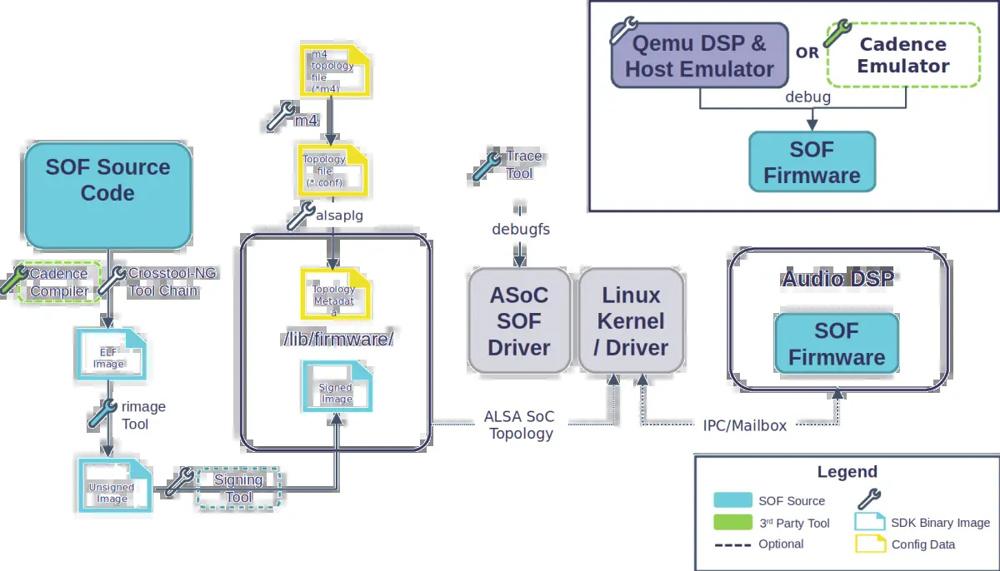

音频开放固件 (Sound Open Firmware，SOF) 是一个开源音频数字信号处理 (DSP) 固件基础架构和 SDK。SOF 作为社区项目，提供基础架构、实时控制件和音频驱动程序。该项目由声音开放固件技术指导委员会 (TSC) 管理，该委员会包括来自社区的杰出和活跃的开发者。SOF 是公开开发的，并托管在 github 平台上。

该固件和 SDK 面向对现代 DSP 上的音频或信号处理感兴趣的开发者。SOF 提供了一个框架，音频开发者可以在其中创建、测试和优化以下内容：

 * 音频处理流水线和拓扑。
 * 音频处理组件。
 * DSP 基础架构和驱动程序。
 * 主机操作系统基础架构和驱动程序。

Sound Open Firmware 具有模块化和通用的代码库，可以移植到不同的 DSP 架构或主机平台。请参阅当前支持的 DSP 架构和支持的平台列表。

## SDK 介绍与概述

Sound Open Firmware SDK 由许多成分组成，可以定制这些成分以用于固件/软件开发生命周期。定制允许 “最适合” 的开发方法，其中 SDK 可以针对特定流程或环境进行优化。有些 SDK 成分是可选的，而其他成分可以有多次选择，如下图所示。

**图 2：SDK 示例配置显示了运行 Linux 操作系统的 Intel Apollo Lake 平台上的 SOF 开发流程。请注意编译器工具链的选择和可选的 DSP 仿真器的选择。**

### SOF 源码、工具和拓扑

所有固件、工具和拓扑都存放在主 SOF git 存储库中。从较高的层面来看，该存储库包含：

 * 固件 - 用 C 语言和一些特定于体系结构的汇编语言编写；它不链接外部依赖项。
 * Test Bench - 允许固件组件和流水线在开发者的主机 PC 上运行。
 * 镜像工具 - 将 ELF 文件转为可以在硬件上运行的二进制固件镜像的 C 工具。
 * 调试工具 - 可用于调试固件的脚本和工具。
 * 追踪工具 - 基于文本的工具，可以显示来自固件的跟踪数据。
 * 调优工具 - 可用于创建音频组件调优系数的 MATLAB/Octave 脚本。
 * 运行时工具 - 可用于与运行中的固件交换数据的命令行应用程序。
 * 拓扑 - 真实和示例拓扑，展示了简单和复杂的音频处理流水线的构建。

### 主机操作系统驱动程序

SOF 可以由主机操作系统驱动程序配置和控制，也可以选择作为独立固件运行。SOF 主机驱动程序当前支持 Linux 操作系统。

SOF 驱动程序具有模块化的基于堆栈的架构，该架构是 BSD 和 GPL 双重许可的代码，允许其移植到其它操作系统和 RTOS。

主机驱动程序负责：
 * 将固件从主机文件系统加载到 DSP 存储器中并启动。
 * 将拓扑从主机文件系统加载到 DSP 中。
 * 将音频控制设备暴露给应用程序。
 * 向应用程序公开音频数据端点。
 * **管理主机和 DSP 之间的 IPC 通信。**
 * 在主机端将 DSP 硬件抽象为通用 API 操作。

对于上面的几点，一般情况下，其主要实现者如下：

 * *将固件从主机文件系统加载到 DSP 存储器中并启动*，完全由主机端的 SOF Linux 驱动程序完成，但 SOF 的 Linux 内核驱动程序框架已经提供了这个功能的实现，SOF Linux 驱动程序可以直接用，如果该实现不能完全满足需要，则该实现也可以作为驱动程序提供这个功能实现的参考。
 * *将拓扑从主机文件系统加载到 DSP 中*，几乎不需要具体的 SOF Linux 驱动程序实现参与，具体的 SOF Linux 驱动程序实现配置拓扑文件的路径，在驱动程序 `probe` 期间，调用 SOF 的 Linux 内核驱动程序框架提供的接口完成。
 * *将音频控制设备暴露给应用程序*，在拓扑配置文件中定义控制项，二进制的拓扑配置通过 ASoC 的拓扑模块被加载时，SOF 的 Linux 内核驱动程序框架的拓扑模块实现这些功能，几乎不需要具体的 SOF Linux 驱动程序实现参与。
 * *向应用程序公开音频数据端点*，在拓扑配置文件中定义 PCM 项，二进制的拓扑配置通过 ASoC 的拓扑模块被加载时，SOF 的 Linux 内核驱动程序框架的拓扑模块及 PCM 和 compress 等模块实现这些功能，几乎不需要具体的 SOF Linux 驱动程序实现参与。
 * *管理主机和 DSP 之间的 IPC 通信*，在 SOF 中，IPC 分为两层，一是底层的 IPC 通道，它负责无差别地在主机操作系统和 DSP 之间传递消息，二是 IPC 消息协议，包括 IPC 通信所用的消息具体格式的定义和处理。IPC 通道完全由具体的 SOF Linux 驱动程序实现，IPC 消息协议由 SOF 的 Linux 内核驱动程序框架，IPC 消息协议需要与拓扑二进制文件的格式匹配。IPC 通道是具体的 SOF Linux 驱动程序实现的重点。
 * *在主机端将 DSP 硬件抽象为通用 API 操作*，拓扑配置文件、SOF 固件和 SOF 的 Linux 内核驱动程序框架配合实现，一般不需要具体的 SOF Linux 驱动程序实现参与。

Linux SOF ALSA/ASoC 驱动程序在 Linux v5.2 版进的内核，但早期版本还不是很完善。

### 固件工具链

GNU GCC 可以与专有的 DSP 供应商编译器一起用作免费的 SOF 编译器。编译器的选择取决于用户，具体取决于功能和预算。GCC 编译器是开源的。

### DSP 仿真器

Qemu 可用于提供功能仿真器来同时跟踪和调试驱动程序和 DSP 固件代码。还可以使用专有的仿真器。

SOF CI 中还使用仿真来在合并新代码之前进行功能验证。

## 一般 FAQ

**固件使用什么许可证？**

固件使用标准 BSD 3 条款许可证发布，其中一些文件在 MIT 下发布。

**我需要开源我的固件代码修改吗？**

不需要。固件的 BSD 和 MIT 许可代码意味着你可以将代码修改保持私有。如果你决定开源你的工作，补丁总是欢迎的。

**主机驱动程序使用什么许可证？**

大多数主机驱动程序代码是双重许可的 BSD 或 GLPLv2（用户选择）。驱动程序中仅属于 GPLv2 的部分是位于驱动程序堆栈顶部的 Linux 集成层。

**我是否需要开源我的驱动程序代码的改动？**

不需要，对于驱动程序栈最底部的两层。比如，如果你把驱动程序移植到了另一个操作系统，这些改动可以保持私有的。注意，所有的驱动程序 GPL 源文件是 Linux 特有的，且不应该被移植到另一个操作系统。

**我如何参与进来？**

参与进来最好的方式是通过 github。你也可以加入我们的 [邮件列表](http://alsa-project.org/mailman/listinfo/sound-open-firmware)。

**开发模型是什么样的？**

SoF (Sound Open Firmware) 完全在 github 上开发。补丁通过 Pull Request 来 review，讨论，并在合并前由 CI 做测试。预期的发布节奏是每 6 - 8 周。稳定版经过 QA 测试之后会打标签；下一个版本的开发仍在继续。

**谁在为 SoF (Sound Open Firmware) 工作？**

来自大量不同公司的专业开发者 (如果想了解更多相关信息的话可以参考 git 日志) 以及一些开发爱好者。

**我如何添加对主机架构 X 的支持？**

请参考 SOF 架构页面。

**我如何添加对主机平台 X 的支持？**

添加新的主机平台比添加新的 DSP 架构简单多了。添加新的主机平台由这么几部分组成，添加一个新的 src/platform/ 目录，其中包含内存映射，IRQs，GPIOs 和 DSP 内存地址空间中的外设。可能也需要在 drivers 目录下添加新的驱动程序 (比如 DMA，I2S 的)。

**我如何移植到其它操作系统？**

请参考 SOF 主机架构页面。

**支持哪些音频组件?**

SoF (Sound Open Firmware) 现在支持一个小的免费开源的组件库，这些组件与源代码一起分发。SOF 还可以支持专有的音频处理组件，只要它们被包装为使用 SOF 组件API。有关开源组件及其功能的列表，请参阅音频组件页面。

**我如何创建我自己的流水线?**

流水线目前是使用 M4 宏处理语言定义的。M4 拓扑在被编译为二进制文件之前先被预处理为 alsaconf 格式。用于流水线构建的基于 Eclipse 的 GUI 目前正在开发中。

如今，上游支持静态 (内置) 和动态 (运行时加载) 流水线。

**我可以添加我自己的媒体编码器/解码器吗?**

当然可以。

**我可以添加非音频的功能吗?**

可以。DSP 所使用的指令集也擅长非音频的处理任务，比如低功耗传感器信号处理。如果你的 DSP 具有其它非音频设备可以连接的物理 IO 端口，那么数据也可以从这些设备处理。

## 工具链 FAQ

**SOF 目前支持哪些 Xtensa 工具链?**

SOF 目前支持两个工具链家族：GCC 和 Cadence XCC。

这些工具链家族被细分为各个 Xtensa ISA 的工具链，因为 Tensilica 架构包含可变的指令集，因此你必须使用与你的平台匹配的工具链。

1. 定制的，开源 GCC 工具链通过 crosstool-NG 构建，如入门指南中所述。它们必须从源代码构建。有关说明，请参阅以下内容：
   * 从入门指南中的 [第 3 步. 从源码构建工具链](https://thesofproject.github.io/latest/getting_started/build-guide/build-from-scratch.html#build-toolchains-from-source) 来了解从头开始构建 SOF。
   * [工具链和嵌入式发行版](http://wiki.linux-xtensa.org/index.php/Toolchain_and_Embedded_Distributions)

2. Cadence 的部分闭源工具链。Cadence XCC 编译器是专有的，但使用了开源的 GNU binutils。XCC 必须从 Cadence 购买。更多信息，请参考：
   * [用第 3 方工具链构建 SOF](https://thesofproject.github.io/latest/getting_started/build-guide/build-3rd-party-toolchain.html#build-3rd-party-toolchain)
   * [Cadence IP组合](https://ip.cadence.com/ipportfolio/tensilica-ip)

Cadence binutils 补丁或覆盖位于 SOF git 存储库中。

请注意，Cadence 并不是 Tensilica 的唯一用户。一些 Xtensa 工具链来自于 [其它地方](https://docs.zephyrproject.org/latest/boards/xtensa/index.html)。然而，截至2020年6月，SOF 支持的所有平台均来自 Cadence。

**Cadence 和 gcc 工具链之间的主要区别是什么？**

gcc 工具链是完全开源的。Cadence 的工具链使用基于 gcc 或基于 clang 的开源前端以及与平台匹配的闭源后端。

XCC 支持完整的 Xtensa HiFi SIMD 内在函数，而 GCC 不支持 HiFi SIMD。这可能会导致巨大的性能差异，尤其是在处理音频处理的代码中。

**Cadence xt-xcc 还是 Cadence xt-clang？**

这取决于平台。截至 2020 年 6 月，SOF 支持的大多数平台都依赖 xt-xcc。展望未来，所有较新的平台都需要 xt-clang。gcc 前端不支持异常大的寄存器，因此迁移到 xt-clang。

请注意，xt-xcc 并不完全支持 C99。xt-clang 可以。

**是否即将支持其它工具链？**

展望未来，我们希望支持 LLVM C 编译器。 欢迎补丁。

[原文](https://thesofproject.github.io/latest/introduction/index.html)
